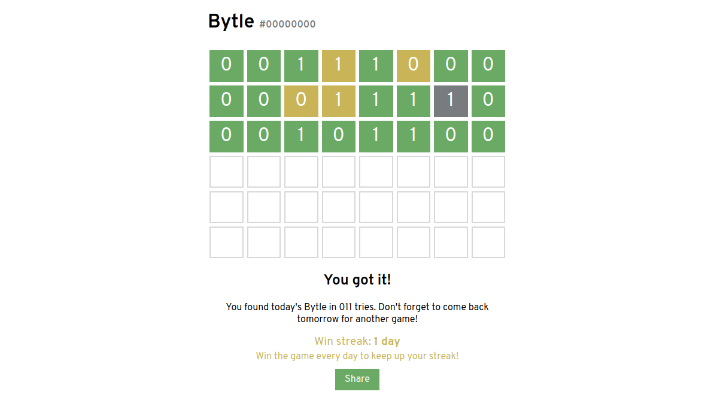

# [Bytle](https://jamesl.me/bytle)
A Wordle-like game where you have to guess the unsigned 8-bit binary number!

Game coded in 2'14"50.570, but it's not like I'm counting how long it took at all! Minimum viable game in 50"58.590.
